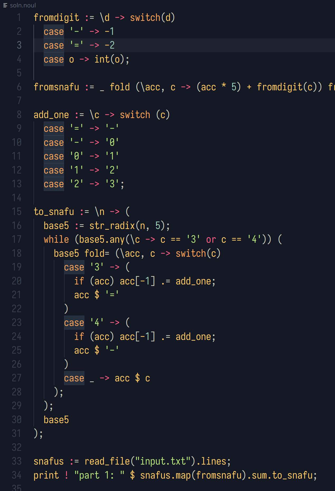

# noulith-lsp

Language server experiment for betaveros's [noulith](https://github.com/betaveros/noulith). I've been wanting to play with language servers, and I really enjoy this language.



## Language server
Supports:
- Semantic syntax highlighting (uses lexer from noulith, included as a crate)

## VSCode plugin
Also includes VSCode plugin, because at least a minimal plugin is required in VSCode to connect to a language server. To use the plugin:

1. Edit the `command` setting in `vscode-noulith/index.js` 
2. Use the following parameters when launching the `code` script
```console
$ code --extensionDevelopmentPath=$PWD
```

